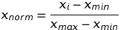
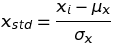

# Structured Query Language (SQL)

### <a name="toc"></a>Table of Contents


[Epicycle of Analysis](#epicycle)

[K-fold Cross Validation](#k_fold)

[Machine Learning](#machine_learning)

[Missing Data](#missing_data)

[Partitioning Data](#partitioning_data)

[Scaling](#scaling)

[Types of Data](#types_of_data)

---

### <a name="epicycle"></a> Epicycle
**Prerequisites**
1. Collect the Data
1. Process the Data

**Data Analysis**
1. Stating and Refining the Question
1. Exploring the Data
1. Building Formal Statistical Models 
1. Interpreting the Results
1. Communicate the Results

#### Process for Each Step
1. Set Expectations
1. Collect Information (data)
1. Compare Data to Expectations
    1. Revise expectations to match data

|     | Set Expectations | Collect Information | Revise Expectations |
| --- | ---------------- | ------------------- | ------------------- |
| Question | Question is of interest to audience | Literature Search | Sharpen question |
| Exploratory Data | Data are appropriate for question | Make exploratory plots of data | Refine question or collect more data |
| Formal Modeling | Primary model answers question | Fit secondary models, sensitivity analysis | Revise formal model to include more predictors |
| Interpretation | Interpretation of analyses provides a specific and meaningful answer to the question | Interpret totality of analyses with focus on effect sizes and uncertainty | Revise Exploratory Data and/or models to provide specific and interpretable answer
| Communication | Process and results of analysis are understood, complete and meaningful to audience | Seek feedback | Revise analyses or approach to presentation |

**One characteristic of a successful data analysis is to raise additional 
pertinent questions to the surface to then be pursued.**

[Table of Contents](#toc)

---

### <a name="k_fold"></a> K-fold Cross Validation
- Method to determine if overfitting occurring
- Process:
  - split data into K randomly-assigned segments
  - reserve one segment as your test data
  - train on each of the remaining K-1 segments and measure performance 
  against the test set
  - take the average of the K-1 r-squared scores

[Table of Contents](#toc)

---

### <a name="machine_learning"></a> Machine Learning
- Algorithms that can learn from observational data, and can make 
predictions based on it.

#### Supervised Learning
- Use a training set to teach the model what you are looking for.
  - Use 80% of the training set to develop the model and reserve 20% of the 
  training set to test the model.
   set to test the model
  - Training and Test data sets need to be large enough to contain 
  representatives of all the variation and outliers in the data.
  - The sets must be randomly selected.
  - This is a good method to guard against overfitting.
- Warnings:
  - Make sure the sample sizes are not too small
  - Be cautious of overfitting
  - check if the training data and test data are "remarkably" similar
- Once the model is trained it is applied to data with unknown values.

#### Unsupervised Learning
- The model is not given and "answers" to learn from; it must make sense of 
the data just given the observations themselves.
- Useful when you don't know what you're looking for; looking for latent 
variables.

[Table of Contents](#toc)


---
### <a name="missing_data"></a> Missing Data
#### Categorical Data
- **Class Label**: name given to common groups of items
- **Nominal Data**: there is no order applied to the categories. (Red is not
 greater than Green)
- **Ordinal Data**: categorical features that can be sored and ordered.

##### Ordinal Features
- convert string values into integers
- create a dictionary to do the mapping between strings and integers

```python
size_mapping = {
    'XL': 3,
    'L': 2,
    'M': 1,
    'S': 0,
}

# apply mapping
df.size = df.size.map(size_mapping)

# invert the mapping
inv_size_mapping = {v: k for (k, v) in size_mapping.items()}
df.size.map(inv_size_mapping)
```

##### Nominal Features
- Class labels need to be mapped to integers, but the order does not matter

###### One Hot Encoder
- Use **OneHotEncoder** followed by a Principal Component Analysis (PCA) to 
reduce dimensionality.
- For n number of categories One Hot Encoder will create an identity array of 
the size n.
    - This allows each category to have a binary value that is not related 
    to the others.

*Example Using Pandas*
```python
import pandas as pd

pd.get_dummies(df)
```

*Example Using Scikit-Learn*
```python
from sklearn.preprocessing import OneHotEncoder

ohe = OneHotEncoder(categorical_features=[0])
ohe.fit_transform(X)
```

###### Label Encoder
- Use **Label Encoder** for decision trees and random forests to save space 
compared to the One Hot Encoder.
```python
from sklearn.preprocessing import LabelEncoder


class_le = LabelEncoder()
y = class_le.fit_transform(df.classlabel.values)

# string representation of class labels
class_le.inverse_transform(y)
```
###### Manual Label Encoder Method
```python
import numpy as np


# create mapping
class_mapping = {label: idx
                 for (idx, label) in enumerate(np.unique(df.classlabel))}

# apply mapping
df.classlabel = df.classlabel.map(class_mapping)

# invert class mapping
inv_class_mapping = {v: k for (k, v) in class_mapping.items()}
df.classlabel = df.classlabel.map(inv_class_mapping)
```


#### Find all rows with missing data.

```python
import io

import pandas as pd


csv_data = """A,B,C,D
1.0,2.0,3.0,4.0
5.0,6.0,,8.0
10.0,11.0,12.0,"""
df = pd.DataFrame(io.StringIO(csv_data))

df.isnull().sum()
```

#### Eliminating Samples with Null Values
- features (columns)
- samples (rows)

```python
# remove rows with missing data
df.dropna()

# remove columns with missing data
df.dropna(axis=1)

# only remove rows where all columns are missing
df.dropna(how='all')

# remove rows with n or more missing values (here n=4)
df.dropna(thresh=4)

# remove rows where missing data appears in a specific column c (here c='C')
df.dropna(subset=['C'])
```

#### Imputation
- Calculate the value of a missing parameter based on the surrounding 
parameters.
- **Fit** the data to the transformer class using a training set
- **Transform** the training set and the test data
- Any data array that is to be transformed needs to have the same number of 
features as the data array that was used to fit the model.

```python
from sklearn.preprocessing import Imputer


# create instance of Imputer class
# strategy: 'mean', 'median'
# axis: 0 = columns, 1 = rows)
imr = Imputer(missing_values='NaN', strategy='mean', axis=0)

# fit the Imputer on the data
imr = imr.fit(df)

# transform data (averages columns to determine value)
imputed_data = imr.transform(df.values)
```
[Table of Contents](#toc)


---
### <a name="partitioning_data"></a> Partitioning Data
- Split Data Into Training and Testing

```python
from sklearn.model_selection import train_test_split


x, y = df.iloc[:,1:].values, df_.iloc[:, 0].values

# make a 70:30 split
x_train, x_test, y_train, y=test = train_test_split(x, y,
                                                    test_size=0.3, 
                                                    random_state=0)
```

[Table of Contents](#toc)

---
### <a name="scaling"></a> Scaling
- The majority of machine learning and optimization algorithms behave much 
better if features are on the same scale.
- **Decision Trees** and **Random Forests** are some of the few that are 
unaffected by scaling.

#### Normalization
- Rescaling of the features to a range of [0, 1], which is a special case of
min-max scaling



```python
from sklearn.preprocessing import MinMaxScaler


mms = MinMaxScaler()
x_trian_norm = mms.fit_transform(x_trian)
x_test_norm = mms.transform(x_test)
```

#### Standardization
- Less common than normalization, but better suited for many machine 
learning algorithms.
- Center feature columns at mean 0 with standard deviation 1, so that the 
feature columns take the form of a normal distribution.
    - This makes it easier to learn the weights.
- Less sensitive to outliers than min-max scaling.



```python
from sklearn.preprocessing import StandardScaler


stdsc = StandardScaler()
x_train_std = stdsc.fit_transform(x_train)
x_test_std = stdsc.transform(x_test)
```

[Table of Contents](#toc)


---

### <a name="types_of_data"></a> Types of Data 

#### Numerical
- Quantitative Measurements

##### Discrete Data
  - integer based; often counts of some event

##### Continuous Data
  - has infinite number of possible values

#### Categorical
- Qualitative Data that has no inherent mathematical meaning
  - numbers can be assigned to the categories, but the numbers have no 
  mathematical meaning

#### Ordinal
- A mixture of numerical and categorical
- data has mathematical meaning

[Table of Contents](#toc)
