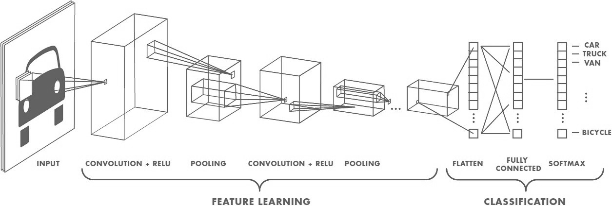
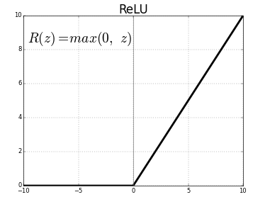
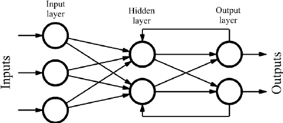

# Neural Networks and Deep Learning
[deeplearning.ai](https://www.coursera.org/learn/neural-networks-deep-learning/home/welcome)

### Table of Contents

[Background](#background)

[Convolutional Neural Network (CNN)](#cnn)

[Neuron](#neuron)

[Recurrent Neural Network (RNN)](#rnn)

[Standard Neural Network](#snn)

[Supervised Learning](#supervised_learning)

---
###  Background
- Scale drives the accuracy of a neural network.
    - large amounts of ***labeled data*** are required (big data)
        - **m**: variable to denote size of labeled data
        - when only small amounts of data are present a subject matter expert
        could make more accurate output forecasts than a data science model.
    - large amounts of computer ***processing power*** are required

[Table of Contents](#toc)

---
###  Convolutional Neural Network (CNN)

#### Common Applications
- Image processing

[Table of Contents](#toc)

---
###  Neuron
- Neurons comprise a layer, hidden layer, of a neural network.
- Each neuron accepts an input and performs a mathematical function to produce
an output.

#### Common Functions

##### ReLU (Rectified Linear Unit)
- This function passes any positive value and clips negative inputs to zero.
- Usually outperforms a sigmoid function, since **gradient decent** is better
suited to this function.
    - y = f(x) = max(0, x)

##### Sigmoid Function
- This function transitions from 0 to 1 about the y-axis using a sinusoidal
shape.
- The portions of the function that are not near x = 0 have a very small slope,
which results in a very small derivative and ***slow*** learning.

[Table of Contents](#toc)

---
###  Recurrent Neural Network (RNN)

- RNN may be trained as a supervised learning problem.

#### Common Applications
- Time Series Problems
- Natural Language Processing

[Table of Contents](#toc)

---
###  Standard Neural Network

[Table of Contents](#toc)

---
###  Supervised Learning
- **Structured Data**
    - Each feature has a well defined meaning.
        - Data found in a database would be a good example.
- **Unstructured Data**
    - Each feature is defined by a related type of data, but not the actual
    feature itself.
        - Images Identification -> pixel values
        - Word Identification from Audio -> frequency values

[Table of Contents](#toc)

