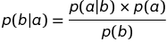
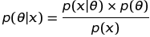

# Statistics

### Table of Contents

[General Information](#general_info)

[Probability Notation](#probability_notation)

[Bayes' Rule](#bayes_rule)

[Bayesian Inference](#bayesian_inference)

[Maximum A Posterior (MAP)](#map)

[Bayes' Factor](#bayes_factor)

---

###  General Information

  - Bayesian Statistics is a method for interpreting evidence in the context
   of previous experience or Knowledge.
  - Independently discovered by Thomas Bayes & Pierre-Simon Laplace.
  - Bayes' rule transforms probabilities that look useful, but are often 
  not, into probabilities that are useful. 

[Table of Contents](#toc)

---

###  Probability Notation

#### Posterior Probability
**p(b | a)**

  - probability of **b** given **a**
  - **p**: probability
  - **|**: given that

This statement is called the "**likelihood**" of **a**.

#### Maximum Likelihood Estimate
The probability with the maximum likelihood.

[Table of Contents](#toc)

---

###  Bayes' Rule 
This is stated as a **Rule**, but in actuality it is a mathematical
**Theorem**.

  - The **marginal likelihood** is also referred to as the **evidence**.

[Table of Contents](#toc)

---

###  Bayesian Inference 
Combine knowledge of a prior experience with observed data to interpret the 
data.

  - Bayesian Inference is not guaranteed to provide the correct answer.
  - BI provides the probability that each number of alternatives is true.  
  Theses probabilities are used to determine the answer that is most probably
   true.
    
[Table of Contents](#toc)

---

###  Maximum A Posterior (MAP)
The decision associated with the maximum value posterior probability.

[Table of Contents](#toc)

---

###  Bayes' Factor
The product of the ratio of likelihoods.

#### Posterior Ratio
#TODO add equation

#### Apply Bayess Rule
#TODO add equations

  - There is a **substantial** difference between the probabilities if the   
  posterior odds (Rpost) meet the following criteria.
  
  #TODO add Rpost images
  
  - Since the **marginal likelihood (evidence)** P(x) is cancelled out of the 
  equation it has **no impact** on the **Bayes' Factor**.
  
  - The **marginal likelihood (evidence)** will have an **impact** on the 
  **estimated probability** of the hypothesis being true.

[Table of Contents](#toc)
