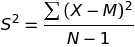

# Statistics

### <a name="toc"></a>Table of Contents

[Definitions](#definitions)

[Bivariate Relationships](#bivariate_relationships)

[Correlation](#correlation)

[Linear Regression](#linear_regression)

[Mean](#mean)

[Median](#median)

[Mode](#mode)

[Moments](#moments)

[Multivariate Regression](#multivariate_regression)

[Percentile](#percentile)

[Polynomial Regression](#polynomial_regression)

[Probability Density Function](#prob_density_func)

[Quartiles](#quartiles)

[Standard Deviation](#standard_deviation)

[Variance](#variance)

---

### <a name="definitions"></a> Definitions
| Term | Definition |
| ---- | ---------- |
| | average value for a population |
|  | average value for sample |
|  | variance of a population |
|  | variance of a sample |
| N | population size |
| n | sample size |
| r | Pearson correlation coefficient |
|  | Standard Deviation of x |
| covariance | a descriptive measure of the linear association between two variables |
| negative relationship | multiple variables which have opposite trends |
| population | all specimens in a set |
| positive relationship | multiple variables which follow the same trends |
| sample | a subset of the population specimens |
| sampling error | the difference between corresponding parameters and statistics |
| statistic | a characteristic of a sample |

[Table of Contents](#toc)

---

### <a name="bivariate_relationships"></a>Bivariate Relationships

#### Covariance
  - a descriptive measure of the linear association between two variables
  - only describes **direction** not magnitude
  - has no upper or lower boundary
  - covariance is **POSITIVE**, **NEGATIVE** or **ZERO**
  - positive covariance would be in quadrants I and III
  - Negative covariance would be in quadrants II and IV
  - When there is not a relationship between two variables the covariance 
  would be equal or near zero
  
##### Sample Covariance


```python
import numpy as np

np.cov(arr_1, arr_2)
```

##### Population Covariance


```python
import numpy as np

np.cov(arr_1, arr_2, bias=True)
```

[Table of Contents](#toc)

---

### <a name="correlation"></a>Correlation
  - Describes the **magnitude** and **direction** of an association
  - Denoted by the lowercase variable r
  - standardized measure of an association (-1 to 1)
  - only applicable to **LINEAR** relationships
  - **Correlation is NOT causation**
  - correlation strength does not necessarily mean the correlation is 
  statistically significant related to sample size
  - correlation is the covariance between the two variables divided by the 
  product of each variables standard deviation
 


```python
import numpy as np

np.corrcoef(arr_1, arr_2)
```

#### Rule of Thumb for Causation
If the following relationship is true then causation exists.


[Table of Contents](#toc)

---

### <a name="linear_regression"></a>Linear Regression
  - If you only have data for one variable then the best predictor for 
  future samples would be the mean value of the data.
  - **residuals** or **error** is the measure between individual data points
  to the best fit model.
  - Also referred to as **Maximum Likelihood Estimation**
  - For 3D surfaces use **Gradient Decent**

#### Coefficient of Determination (R-Squared)
  - The fraction of the total variation in Y that is captured by the 
  regression model.
  - Way to quantify how well the regression model matches the data.
    - value of 1 would be perfect


```python
from sklearn.metrics import r2_score

r2 = r2_score(test_y, regression(test_x))
```
  
[Table of Contents](#toc)

---

### <a name="mean"></a> Mean 
- Average of a population
  - sum / number of samples

```python
import numpy as np

arr = np.array([1, 2, 3])
mean = arr.mean()
```

#### Weighted Mean
- Values may be assigned different levels of importance


```python
import numpy as np

arr = np.array([1, 2, 3])
weights = np.array([1, 10, 100])
weighted_mean = np.average(a=arr, weights=weights)
```

[Table of Contents](#toc)

---

### <a name="median"></a> Median
- Equivalent to the 50th percentile.
- **Median is less susceptible to outliers than the mean**
  - whenever you present a mean value also show the median
  
1. Sort all the values and select the midpoint
1. If there is an even number of values then average the two located at the 
midpoint

```python
import numpy as np

arr = np.array([1, 2, 3])
median = np.median(arr)
```

[Table of Contents](#toc)

---

### <a name="mode"></a> Mode
- most common value in a data set
  - not relevant to continuous numerical data

```python
import numpy as np
import scipy.stats as stats

arr = np.array([1, 2, 3])
mode = stats.mode(arr)
```

[Table of Contents](#toc)

---

### <a name="moments"></a> Moments
- Quantitative measures of the shape of a probability density function.


- 1st Moment: Mean
- 2nd Moment: Variance
- 3rd Moment: Skew
  - describes if the data is shifted to one side
  - data with a longer tail on the left will be skewed left (negative skew)
- 4th Moment: Kurtosis
  - describes how thick is  the tail, and how sharp is the peak when compared
  to a normal distribution
  - higher peaks have a higher kurtosis
  
```python
import numpy as np
import scipy as sp


arr = np.random.normal(0, 0.5, 1000)

moment_1 = np.mean(arr)
moment_2 = np.var(arr)
moment_3 = sp.stats.skew(arr)
moment_4 = sp.stats.kurtosis(arr)
```

[Table of Contents](#toc)

---

### <a name="multivariate_regression"></a> Multivariate Regression
- value prediction of a single variable based on multiple other variables
- **Assumes** the different factors are not themselves dependent on each other
- r-squared can still be used to quantify the fit

[Table of Contents](#toc)

---

### <a name="percentile"></a> Percentile
- A value in the X percentile means the value is greater than X% of the 
total samples.

```python
import numpy as np

np.percentile(array, desired_percentile)
```

#### Quartiles
- The 25%, 50% and 75% percentiles
- **Inner Quartile Range** is the values between 25% and 75%.

[Table of Contents](#toc)

---

### <a name="polynomial_regression"></a> Polynomial Regression
- Regression fitting with a higher order polynomials
- order of 1 in a linear fit just like Least Squares Linear Regression
- Be cautious of using too high a polynomial and over fitting
  - This will yield a higher r squared value and more accurately represent 
  the data you have, but will not be useful for making predictive estimates 
  on new data.

```python
import numpy as np

x = np.random.normal(1, 100, 1000)
y = np.random.normal(50, 200, 1000)
fit = np.polyfit(x, y, deg=3)
```
[Table of Contents](#toc)


---

### <a name="prob_density_func"></a> Probability Density Function
- Probably of data point falling within a range of values.
- If the data is **discrete** then it would be referred to as a 
**Probability Mass Function**
  - Histograms are Probability Mass Functions

- Gaussian Distribution
    - 1 STD: 68.2%
    - 2 STD: 95.4%
    - 3 STD: 99.8%

[Table of Contents](#toc)

---

### <a name="quartiles"></a> Quartiles
- Divide the population into 4 equal groups
  - Q1: 25% (Median of 1st half)
  - Q2: Median
  - Q3: 75% (Median of 2nd half)

1. Find the median
1. Find the median of the 1st half of values
1. Find the median of the 2nd half of values
1. Find the Inner Quartile Range (IQR)
    1. Q3 - Q1

[Table of Contents](#toc)

---

### <a name="standard_deviation"></a> Standard Deviation
- Standard deviation is the square root of the variance.
- Values outside one standard deviation are considered to be outliers.

```python
import numpy as np

a = np.array([1, 2, 3, 4, 2, 1])
std_dev = a.std()
```

[Table of Contents](#toc)

---

### <a name="variance"></a> Variance
- The average of the squared differences from the mean.
- Population Variance: 
- Sample Variance: 

1. Find the mean
1. Find differences from the mean
1. Square the differences
1. Average the differences
    - Population: divide by all N samples
    - Sampled Data: divide by N - 1

```python
import numpy as np

a = np.array([1, 4, 5, 4, 8])
population_variance = a.var()
sample_variance = a.var(ddof=1)
```

[Table of Contents](#toc)

